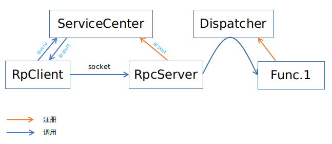

# DragonFly
一个轻量级分布式RPC框架

## 整体架构

## 使用说明
1. 启动zookeeper
2. constants.py中配置注册中心的zookeeper相关参数
3. 切到examples目录
4. 启动服务端示例(可启动多个)：`python3 server.py [host] [port]`
5. 启动客户端示例(可启动多个)：`python3 client.py`

## 特性支持

- [x] 函数级别同步远程调用
- [x] Josn格式数据传输
- [x] 服务端实例级别分布式，支持负载均衡与故障转移
- [ ] 异步远程调用
- [ ] 共享客户端
- [ ] 负载均衡算法：一致性hash